# Mekstrike

## Running / trying

### Requirements

- Kubernetes with an ability to build images on the nodes. For simplicity sake; docker-desktop or minikube (untested)
- This will install a traefik ingress. If you already have an ingress, you'll need to fix yourself using the resources in the k8s folder.

### Quickstart

```sh
# Set up a kubernetes platorm, with certman, dapr, jaeger, otel
./setup.sh

# Build and deploy
./deploy.sh

# Incremental deploy

./deploy.sh ui # or gamemaster, armybuilder, unit, battlefield, etc.
```

## Developing: requirements

- GoLang 1.16 (or later)
- DotNet 6.0 (or later)
- Java 16 (or later)
- Maven (something recent)

## Components

desired:


### library

- golang
- rest endpoints for querying unit data

### armybuilder

- java
- grpc service for creating an army
  - Takes input parameters for generating a force
  - Generate force - query library for units
  - creates and returns unit URI's
  
### gamemaster

- Go
- REST
  - players
  - the battlefield
  - involved units
  - rounds / phases

### battlefield

- .NET
- Actor
  - Given board x, can a unit move from x to y?
  - etc

### unit

- Java
- Actor
  - Move here
  - Fire here
  - handle IncomingFire
  - etc
  - knows which map its on, and its location

### fireControlSystem

- Python for shits and giggles?
  - will translate *shots* to *incoming fire*, given RNG and all kinds of considerations;
  - Client -> Unit(fire) -> FireControlSystem(verifyShot) -> target(processIncoming)
  
### API Gateway

- A simple API gateway so client does not need knowledge of backend services?

### UI

- Svelte webapp
- CSS: <https://terminalcss.xyz/>
